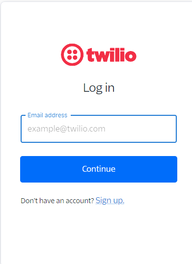

# BruDial

BruDial is an advanced communication platform that allows users to chat and make voice calls with ease and reliability. Leveraging the power of **Twilio**'s robust communication APIs, BruDial provides users with unique phone numbers for secure and efficient connectivity. Whether it's a casual conversation or a critical business call, BruDial ensures you stay connected with crystal-clear voice quality and real-time messaging capabilities. 


# Key Features

### Instant Messaging
- Send and receive text messages instantly.
- Share photos, videos, and other media files seamlessly.
- Enjoy encrypted conversations for enhanced privacy and security.

### Voice Calling  
- Make high-quality voice calls using Twilio-generated phone numbers.
- Experience low-latency and reliable connections.
- Save call history for easy reference and follow-up.

### Administrative Control
- Admin panel for managing user accounts and permissions.
- Monitor and control communication activities within the organization.
- Ensure compliance with organizational policies and standards.    
  
  
## BruDial Tech Stack Overview

### Backend
- **Java**: Leveraging the robustness and performance of Java to handle server-side logic efficiently.
- **Spring Boot**: Utilizing Spring Boot for its simplicity, scalability, and powerful features, enabling rapid development and deployment of secure and maintainable APIs.

### Frontend
- **React**: Building an interactive and responsive user interface with React, ensuring a smooth and engaging user experience. React’s component-based architecture makes the application scalable and easy to maintain.

### Communication Integration
- **Twilio APIs**: Integrating Twilio’s powerful APIs for voice and messaging services, enabling high-quality, real-time communication features such as voice calls, text messaging, and phone number management.

## Twilio

### Overview
Twilio is a cloud communications platform that enables developers to build, scale, and operate real-time communications within their software applications. It provides a suite of APIs (Application Programming Interfaces) and tools that allow businesses to integrate various forms of communication, such as voice, text messaging (SMS), video, and email, into their applications without having to build and maintain complex telecommunication infrastructure.

### Twilio Features

- **Programmable Voice**: Enables applications to make and receive phone calls, providing features like call routing, conferencing, and recording.

- **Programmable Messaging**: Allows sending and receiving SMS, MMS, and WhatsApp messages. This is often used for notifications, alerts, and customer service interactions.

- **Video**: Provides APIs for adding video chat and conferencing capabilities to applications.
- **Email**: Through its acquisition of SendGrid, Twilio offers email delivery services, allowing applications to send transactional and marketing emails.
- **Twilio Flex**: A fully programmable cloud contact center platform that lets businesses customize their customer service experience.
- **Twilio Conversations**: Manages multi-channel conversations across SMS, WhatsApp, and chat.
- **Twilio Functions**: A serverless environment to run your code in response to Twilio events without managing infrastructure.
- **Security**: Includes Twilio Verify for phone number verification and two-factor authentication (2FA), and Authy for multi-factor authentication (MFA).

### Phone Numbers with Messaging and Voice Functionality

#### Types of Phone Numbers

- **Long Codes**: A 10-digit number for SMS and voice calls with localized identity.
- **Toll-Free Numbers**: Business messaging phone number with a 3-digit prefix (e.g., 800) for high-throughput SMS and voice calls.
- **Short Codes**: A short number (5-6 digits) designed for high-throughput two-way SMS messaging.


## Using Twilio with BruDial

## 1. Setting Up Twilio

### Sign Up and Get a Trial Phone Number

#### Sign Up for Twilio:
1. Visit the [Twilio website](https://www.twilio.com/).
2. Sign up for a free trial account.
3. Verify your email and phone number.

#### Get a Trial Phone Number:
1. Once logged in, navigate to the **Console Dashboard**.
2. Click on **Get a Number** to obtain a Twilio phone number.
3. Choose a number with voice and SMS capabilities.




# 2. Making Calls and Sending Messages Using Java and Spring Boot
### Prerequisites
Ensure you have Java and Spring Boot set up in your development environment.
Add the Twilio Java SDK to your project. You can do this by including the following dependency in your pom.xml file (for Maven):

```js
<dependency>
    <groupId>com.twilio.sdk</groupId>
    <artifactId>twilio</artifactId>
    <version>8.25.0</version>
</dependency>
```

### Configuring Twilio in Your Spring Boot Application
1. __Add Twilio Credentials in application.properties__

```properties
twilio.accountSid=your_account_sid
twilio.authToken=your_auth_token
twilio.phoneNumber=your_twilio_phone_number
```


## Create a Java application and run this code to make the first call!
```java
package com.twilio.Project;
import com.twilio.Twilio;
import com.twilio.rest.api.v2010.account.Call;
import java.net.URI;
import java.net.URISyntaxException;
import com.twilio.type.PhoneNumber;

public class CallExample {

        // Find your Account SID and Auth Token at twilio.com/console
        // and set the environment variables. See http://twil.io/secure
        public static final String ACCOUNT_SID = System.getenv("TWILIO_ACCOUNT_SID");
        public static final String AUTH_TOKEN = System.getenv("TWILIO_AUTH_TOKEN");

        public static void main(String[] args) throws URISyntaxException {
            Twilio.init(ACCOUNT_SID, AUTH_TOKEN);
            callCall();
        }
    private static void callCall() throws URISyntaxException {
		Call call = Call
				.creator(
						new PhoneNumber("+91XXXXXXXXXX"), // your indian number which you used to login with Twilio
						new PhoneNumber("+1XXXXXXXXXX"), // Twilio generated trial Number
						new URI("http://demo.twilio.com/docs/voice.xml")
				)
				.create();

		System.out.println(call.getSid());
	}
}
```

## Similarly we can send a message using the Message class in Twilio SDK
```java
package com.twilio.Project;

import com.twilio.Twilio;
import com.twilio.rest.api.v2010.account.Message;
import com.twilio.type.PhoneNumber;

public class SmsExample {

    // Find your Account SID and Auth Token at twilio.com/console
    // and set the environment variables. See http://twil.io/secure
    public static final String ACCOUNT_SID = System.getenv("TWILIO_ACCOUNT_SID");
    public static final String AUTH_TOKEN = System.getenv("TWILIO_AUTH_TOKEN");

    public static void main(String[] args) {
        Twilio.init(ACCOUNT_SID, AUTH_TOKEN);
        sendMessage();
    }

    private static void sendMessage() {
        Message message = Message
                .creator(
                        new PhoneNumber("+91XXXXXXXXXX"), // your Indian number which you used to login with Twilio
                        new PhoneNumber("+1XXXXXXXXXX"), // Twilio generated trial Number
                        "Hello from Twilio!")
                .create();

        System.out.println(message.getSid());
    }
}

```

## We can create an instance of Conversation class from twilio SDK to attach multiple messages with one single conversation and return the metadata in JSON format so as to use it in the frontend.

```java
package com.twilio.Project;

// Install the Java helper library from twilio.com/docs/java/install

import com.twilio.Twilio;
import com.twilio.rest.conversations.v1.Conversation;

public class ConversationExample {
    // Find your Account SID and Auth Token at twilio.com/console
    // and set the environment variables. See http://twil.io/secure
    public static final String ACCOUNT_SID = System.getenv("TWILIO_ACCOUNT_SID");
    public static final String AUTH_TOKEN = System.getenv("TWILIO_AUTH_TOKEN");

    public static void main(String[] args) {
        Twilio.init(ACCOUNT_SID, AUTH_TOKEN);
        Conversation conversation = Conversation.creator()
                .setFriendlyName("Friendly Conversation").create();

        System.out.println(conversation.getSid());
    }
}

```

### This snippet will help us to initialize a conversation and get its Sid and then use the *Sid* to push any message into this conversation.

```java
package com.twilio.Project;

// Install the Java helper library from twilio.com/docs/java/install

import com.twilio.Twilio;
import com.twilio.rest.conversations.v1.conversation.Message;

public class MessageExample {
    // Find your Account SID and Auth Token at twilio.com/console
    // and set the environment variables. See http://twil.io/secure
    public static final String ACCOUNT_SID = System.getenv("TWILIO_ACCOUNT_SID");
    public static final String AUTH_TOKEN = System.getenv("TWILIO_AUTH_TOKEN");

    public static void main(String[] args) {
        Twilio.init(ACCOUNT_SID, AUTH_TOKEN);
            Message message = Message.creator("Sid generated from the previous code")
                .setAuthor("BruDial_Admin").setBody("This is BruDial admin sending a message in the friendly conversation").create();

        System.out.println(message.getSid());
    }
}
```


## We can then call this API given by twilio to get the details of our conversation and messages

https://conversations.twilio.com/v1/Conversations/Conversation_ID/Messages

## This will return a JSON responese something like this
```json
{
    "meta": {
        "page": 0,
        "page_size": 50,
        "first_page_url": "https://conversations.twilio.com/v1/Conversations/CHa676deb81c854079a2c062a79898dd95/Messages?PageSize=50&Page=0",
        "previous_page_url": null,
        "url": "https://conversations.twilio.com/v1/Conversations/CHa676deb81c854079a2c062a79898dd95/Messages?PageSize=50&Page=0",
        "next_page_url": null,
        "key": "messages"
    },
    "messages": [
        {
            "body": "Hello Thgere",
            "index": 0,
            "author": "Varun",
            "date_updated": "2024-06-12T12:13:37Z",
            "media": null,
            "participant_sid": null,
            "conversation_sid": "CHa676deb81c854079a2c062a79898dd95",
            "account_sid": "ACCOUNT_SID",
            "delivery": null,
            "url": "https://conversations.twilio.com/v1/Conversations/CHa676deb81c854079a2c062a79898dd95/Messages/IM7e78a83ffc294979b92658e1161bc8b9",
            "date_created": "2024-06-12T12:13:37Z",
            "content_sid": null,
            "sid": "IM7e78a83ffc294979b92658e1161bc8b9",
            "attributes": "{}",
            "links": {
                "delivery_receipts": "https://conversations.twilio.com/v1/Conversations/CHa676deb81c854079a2c062a79898dd95/Messages/IM7e78a83ffc294979b92658e1161bc8b9/Receipts",
                "channel_metadata": "https://conversations.twilio.com/v1/Conversations/CHa676deb81c854079a2c062a79898dd95/Messages/IM7e78a83ffc294979b92658e1161bc8b9/ChannelMetadata"
            }
        },
        {
            "body": "This is Tonpere sending a message",
            "index": 1,
            "author": "TonpereOP",
            "date_updated": "2024-06-12T12:43:07Z",
            "media": null,
            "participant_sid": null,
            "conversation_sid": "CHa676deb81c854079a2c062a79898dd95",
            "account_sid": "ACCOUNT_SID",
            "delivery": null,
            "url": "https://conversations.twilio.com/v1/Conversations/CHa676deb81c854079a2c062a79898dd95/Messages/IM4dcb3a4908b4436eac6ec67250ebff99",
            "date_created": "2024-06-12T12:43:07Z",
            "content_sid": null,
            "sid": "IM4dcb3a4908b4436eac6ec67250ebff99",
            "attributes": "{}",
            "links": {
                "delivery_receipts": "https://conversations.twilio.com/v1/Conversations/CHa676deb81c854079a2c062a79898dd95/Messages/IM4dcb3a4908b4436eac6ec67250ebff99/Receipts",
                "channel_metadata": "https://conversations.twilio.com/v1/Conversations/CHa676deb81c854079a2c062a79898dd95/Messages/IM4dcb3a4908b4436eac6ec67250ebff99/ChannelMetadata"
            }
        }
    ]
}
```
